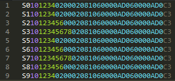

SREC HEX file format syntax definition
=======================================

This is a [Sublime Text 3](https://www.sublimetext.com/3) syntax definition for
the [SREC file format](https://en.wikipedia.org/wiki/SREC_(file_format)).
It's designed to help with inspecting your hex files by setting a different
color for a record's length, address, type, data and checksum allowing to
more easily distinguish them.

The scopes have been somewhat hackisly chosen to be consistent with the
[SREC_HEX template on Wikipedia](https://en.wikipedia.org/wiki/Template:SREC_HEX)
when using Sublime Text's default Monokai color scheme. They have no other
meaning in any way.

Original idea from @seppestas work on [Intel HEX](https://github.com/seppestas/intel-hex-syntax).
